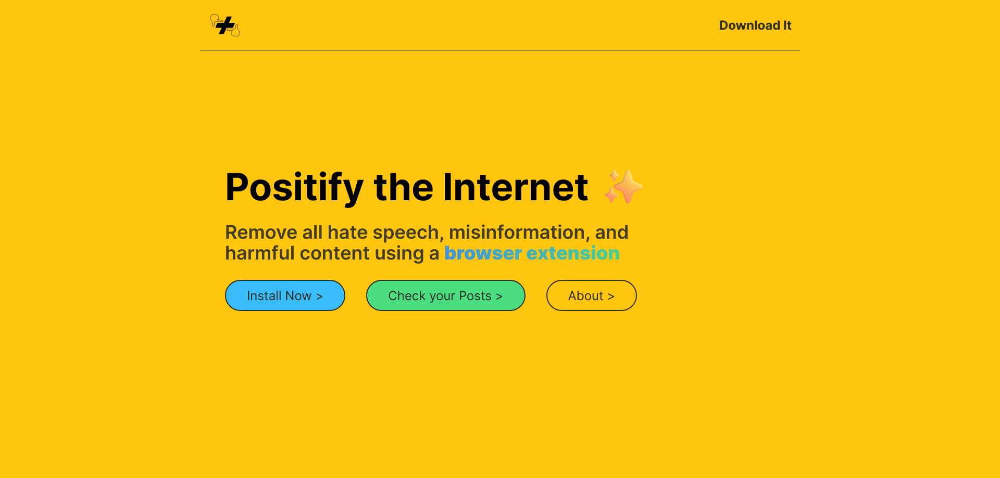
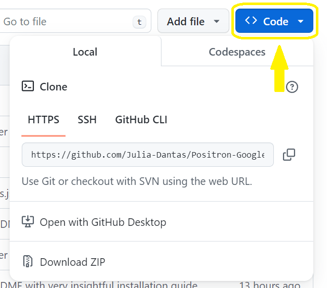
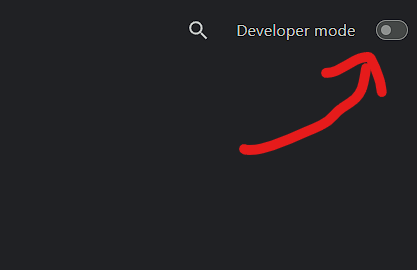

# Positron

Positron is a browser extension that removes all hate speech, misinformation, and harmful content from your feed! 

Learn more on the [website](https://positron-rouge.vercel.app/) or download the extension directly on the [GitHub](https://github.com/Julia-Dantas/Positron-Google-Chrome-Extension). Follow the instruction [below](#Installation Guide) to install. 

## Demo

TODO: insert demo here

## Installation Guide

To install this extension

1. Clone this GitHub repo or download zip

2. Unzip download (don't need to unzip if cloned)

3. Go to Chrome extension page by going to [chrome://extensions/](chrome://extensions/) (as a URL address)

4. Hit the Developer mode toggle to on (screenshot is off)

5. Click Load unpacked and navigate to the unzipped folder

6. Confirm

Now you have the extension installed!! 🤩

### Enable Developer Mode

Go to [`chrome://extensions/`](chrome://extensions/) and 

## Inspiration ✨

In a world full of misinformation, hate speech, and harmful content, it overwhelms and negatively effects people. Research has shown that negative posts can effect your mental state. With our extension, we can hide hateful content **automagically ✨**! You can also check if your post will be flagged by our system by checking your post on the website before you post!

## What it does 🤔

Positron is a **Chrome extension** that scans all posts on your social media feed and hides them before you even see it. Our extension gives a reason for why it hide the post and allows you to view it if you so choose. There are several types of post that our system will flag including hate speech, self harm, harassment, and more. If you want to check to see if your post will be flagged by our systems before you post on your social media account, you can do so on the [website](https://positron-rouge.vercel.app/check). Enter your post into the textbox and hit enter. The AI bot will check the post and will tell you if it will be flagged. If it is flagged, you can click on it to find out more about why it is flagged and how to avoid it from being flagged by the system. 

## How we built it 💻

For the website we used the [T3 stack](https://create.t3.gg/) which consists of Tailwind, TypeScript, and tRPC. It makes use of React and Nextjs. For this project we also used a few animations from [shadcn](https://ui.shadcn.com/).

For the browser extension, we created from scratch using JavaScript. Currently it only works on a select number of social media sites since we need to hardcode where the posts of that social media are defined. A possible addition to this project would be able to highlight a text and let the AI bot tell you if the highlighted text is potentially harmful. 

All the systems were linked up to OpenAI's API for detecting naughty language. This API is our backend. 

All visual assets were made during the hackathon including the logo in Adobe Illustrator and the 3D video made in Blender!

## Challenges we ran into 😤

Trying to figure out how Chrome extensions work was a big challenge. Especially with chrome trying to roll out manifest V3, the internet had mixed information on which code is for what. Since some features were not available on V3 compared to V2, we stuck with V2. 

Another challenge is trying to get libraries to work with something like the T3 stack framework. Usually installing component libraries aren't too bad but this proved rather challenging compared to what it was normally. 

## Accomplishments that we're proud of 😌

It's very pretty. We made sure it was aesthetically pleasing and the use cases made sense. Additionally, we tried to make the website mobile friendly so people can check if there posts are flagged by our system before they post it on social media. 

## What we learned 🧠

* How to make a Chrome extension and how manifest V3 differs from V2.
* Making something mobile friendly always takes more time than you think! 
* shadcn library is a pain to combine with the T3 stack.

## What's next for Positron 🎯

An interesting next step would be to also include image capacities to limit potentially harmful images from being shown. Additionally, adding more sites to curate and block harmful content like Threads or Mastodon. 

### Links

Check out our Devpost submission [here](https://devpost.com/software/positron-ebukjt)
